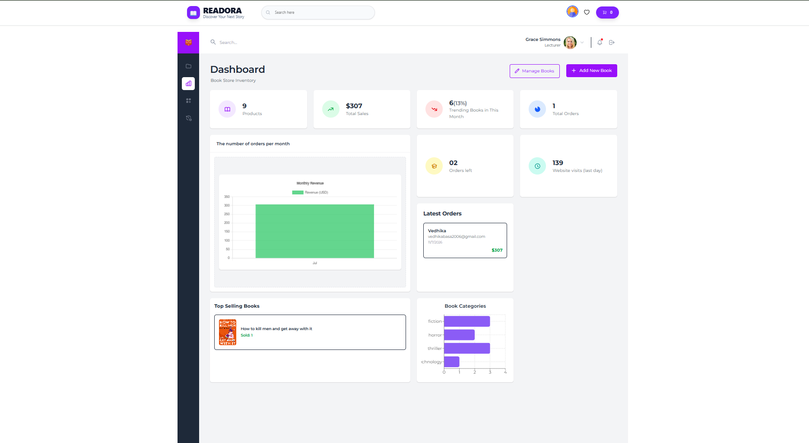
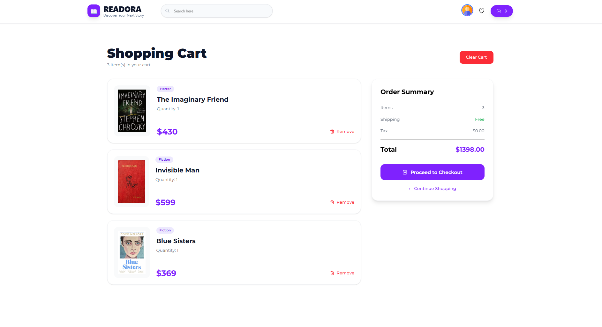

# 📚 Readora


| Home Page | Admin Dashboard |
| :--------: | :-------------: |
|  |  |

<h1 align="center">Readora</h1>

<div align="center">

A modern **Full-Stack MERN Bookstore** built using **React, Redux Toolkit, Node.js, Express.js, MongoDB, Firebase Authentication, and Tailwind CSS**.

Readora allows users to discover books, search by category, manage their cart, place orders, and explore a clean, responsive shopping experience. Administrators can efficiently manage books, monitor orders, and view sales analytics through a dedicated dashboard.

</div>

---

# ✨ Features

### 👤 User Features

- 🔐 Secure Authentication using **Firebase Authentication**
- 🔍 Search books instantly
- 📚 Browse books by category
- ❤️ Wishlist-ready UI
- 🛒 Add and remove books from cart
- 💳 Checkout and place orders
- 📦 View order history
- 📱 Fully responsive across all devices

### 👨‍💼 Admin Features

- 📊 Interactive Dashboard
- ➕ Add new books
- ✏️ Update existing books
- ❌ Delete books
- 📚 Manage inventory
- 📈 Sales Analytics
- 📦 Monitor customer orders

---

# 🚀 Tech Stack

## Frontend

- React
- TypeScript
- Redux Toolkit
- React Router
- Tailwind CSS
- Swiper.js
- React Hook Form
- Chart.js
- SweetAlert2
- Firebase Authentication

## Backend

- Node.js
- Express.js
- MongoDB
- Mongoose
- JWT Authentication
- bcrypt
- dotenv
- CORS

---

# 🎨 UI Highlights

- Modern Apple-inspired UI
- Responsive Design
- Professional Admin Dashboard
- Interactive Charts
- Premium Product Cards
- Sticky Navigation
- Order Summary
- Beautiful Checkout Experience
- Clean Typography & Spacing

---

# 📂 Project Structure

```
Readora
│
├── frontend
│   ├── components
│   ├── pages
│   ├── redux
│   ├── routes
│   ├── assets
│   └── utils
│
├── backend
│   ├── controllers
│   ├── models
│   ├── routes
│   ├── middleware
│   └── config
│
└── README.md
```

---

# 📖 What I Learned

Building **Readora** helped me strengthen my knowledge in:

- Building scalable MERN applications
- Creating REST APIs with Express.js
- MongoDB database design using Mongoose
- Firebase Authentication integration
- State management using Redux Toolkit
- Building responsive UIs using Tailwind CSS
- Implementing protected routes & role-based access
- Designing modern e-commerce user experiences
- Managing orders and inventory through an admin dashboard

---

# 🔮 Future Enhancements

- ⭐ Book Reviews & Ratings
- ❤️ Wishlist Functionality
- 🔔 Email Notifications
- 💳 Online Payment Gateway (Stripe/Razorpay)
- 📄 Pagination & Infinite Scrolling
- 🤖 AI Book Recommendations
- 🌙 Dark Mode
- 📈 Advanced Analytics Dashboard

---

# 🛠 Installation

### Clone the repository

```bash
git clone https://github.com/yourusername/readora.git
```

### Frontend

```bash
cd frontend
npm install
npm run dev
```

### Backend

```bash
cd backend
npm install
npm run dev
```

---

# 📸 Screenshots

## Home


## Cart



## Dashboard


---

# 🤝 Contributing

Contributions, issues, and feature requests are welcome.

Feel free to fork the repository and submit a pull request.

---

# 📄 License

MIT License

Copyright (c) 2026 Vedhika Basa

---

<div align="center">

Made with ❤️ using the MERN Stack by **Vedhika Basa**

</div>